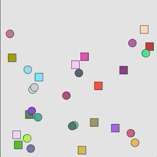

# Skriftlig opgave i Programmering B - 2021

Grundet den ekstraordinære coronasituation har jeg fremstillet en lille skriftlig opgave. I får ikke feedback på resultaterne eller en direkte karakter, men den kommer på en eller anden måde til at indgå i den samlede vurdering til jeres årskarakter.

​     

​     

## Info

Opgaven indeholder en række små del-opgaver der enten er selvstændige eller hænger sammen. De er designet til at dække de faglige mål samt kernestoffet fra læreplanen.

Læreplanen til programmering b kan ses her [https://www.uvm.dk/-/media/filer/uvm/gym-laereplaner-2017/valgfag/programmering-b-valgfag-august-2017.pdf?la=da](https://www.uvm.dk/-/media/filer/uvm/gym-laereplaner-2017/valgfag/programmering-b-valgfag-august-2017.pdf?la=da)

​     

#### Hjælpemidler

Alle hjælpemidler er til rådighed. Det er stadig ikke tilladt at plagiere eller selvplagiere, hvilket betyder at kopiere noget direkte som andre har lavet eller noget man har afleveret før. Opgaverne køres gennem plagiat check. 

Det er ikke tilladt at dele kode mellem hinanden på nogen måde, opdages det bortvises alle de implicerede øjeblikkeligt og opgaven takseres til -3. 

Det er selv følgelig tilladt at se hvordan andre har løst noget og gøre det på samme måde, som for eksempel eksempler inde fra referencen eller stack owerflow etc. Men copy pase er et absolut NO GO!.

Jeg er til stæde under prøven for at svare på spørgsmål til opgaveformuleringen eller teknisk hjælp, men hjælper eller svare ikke på andre spørgsmål.

​     

#### Valg af sprog

I kan enten vælge at lave jeres opgave i *p5.js* eller *Processing 3*. Der er links til de to muligheder neden under.

[https://p5js.org](p5.js site)

​     

I må også gerne bruge Visual Studio Code og Live Server, men husk det kræver et tomt eksempel projekt.

​     

For jer der ønsker at bruge Processing 3.0 følge nedenstående link og download appen.

[https://processing.org](https://processing.org)

​     

#### Aflevering

Jeg har lavet en aflevering på Lectio, når i har afleveret må i gå. Hvis i aflevere i Processing skal i aflevere .pde filen/filerne i zip format og i p5.js skal i downloade jeres sketch folder og zippe den og uploade den.

​     

## Opgaven

Spawn i alt 30 objekter tilfældigt rundt på canvas. Objekterne er tilfældigt valgt mellem to klasser (Klasse 1 / Klasse 2). Objekterne spawner ét ad gangen med ét sekund mellem hver (det vil så tage ca 30 sekunder før alle er spawnet).

Navngivning af variabler og klasser er valgfrit.

​     

#### Specifikke krav

***Disse krav skal overholdes, hvis ikke trækker det fra i den samlede bedømmelse.***

​     

I **SKAL** skrive kommentare til jeres kode!!!

​     

Opløsning på canvas: 400 x 400

​     

Klasse 1:

Cirkel/ellipse

Radius 20

Bevæger sig tilfældigt rundt én pixel ad gangen. Kan ikke gå ud af skærmen, heller ikke delvist.

Skifter til en ny tilfældig farve hvert sekund. 

​     

Klasse 2:

Nedarver fra klasse 1

Skal kunne det samme som klasse 1 dog skal formen være en **Firkant** 20 x 20

​     

Note: Hvis farverne driller i gif eksemplet er det pga gif komprimering. 

​           

